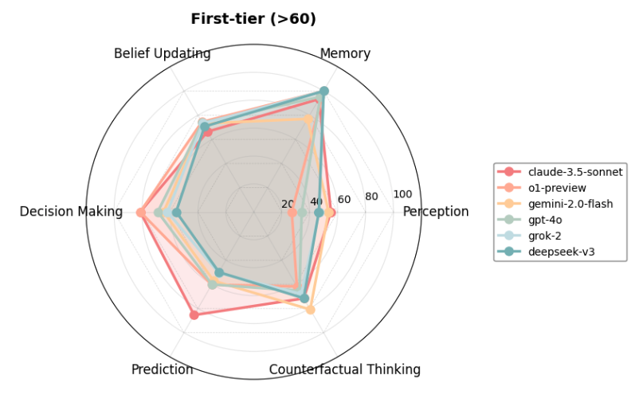
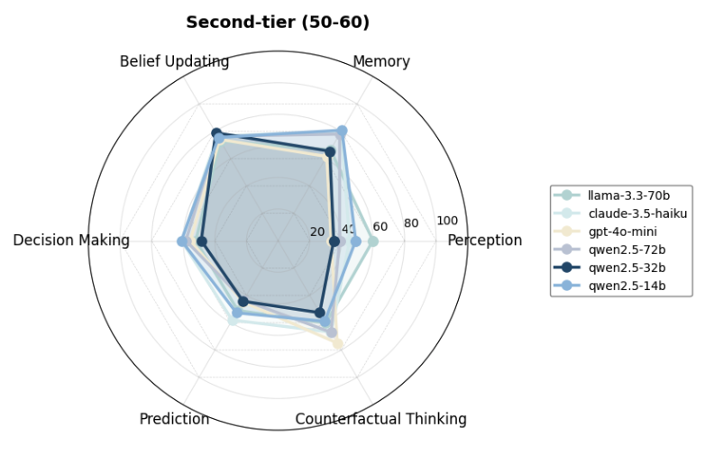
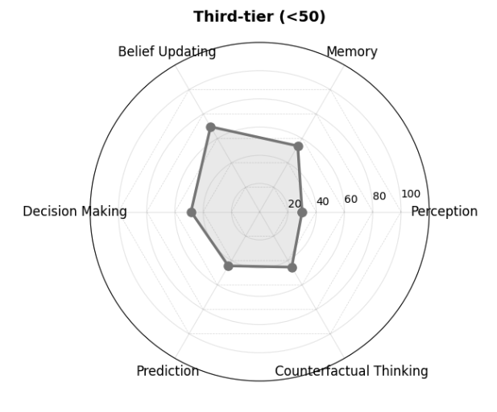
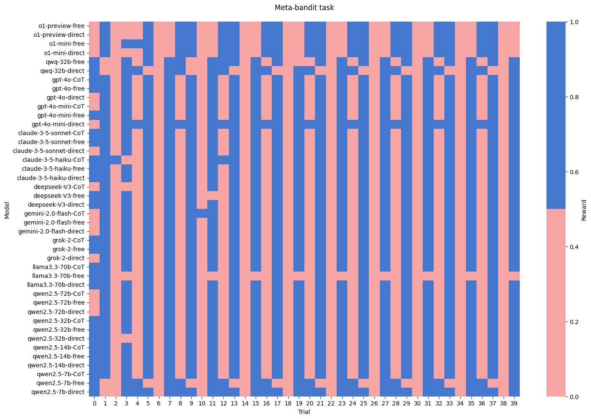

# 🪞Reflection-Bench

<p align="center">
    
    <br>
    <em>Las Meninas</em>, Diego Velázquez, 1656
</p>


## Overview


**Reflection-Bench** is an open-source benchmark ***inspired by cognitive psychology***, designed to systematically evaluate the capabilities of large language models (LLMs) as the core of autonomous agents. It focuses on seven interrelated cognitive dimensions: prediction, decision-making, perception, memory, counterfactual thinking, belief updating, and meta-reflection. Correspondingly, Reflection-Bench involves 7 ***parameterized*** cogntive tests, making it ***contamination-fre*e**.

🌟 Explore more on our project website: [ReflectionBench.github.io](https://ReflectionBench.github.io).

## Tasks

<p align="center">
  
  <br>
  <em>Reflection-Bench: assessment architecture</em>
</p>


<p align="center">

|  | Cognition focus  | Task                                     | Trials| Sessions| 
|--|------------------|------------------------------------------|-------|---------|
| A| Perception       | Oddball Paradigm                         |50     | 3       | 
| B| Working memory   | N-back task                              |52     | 2       | 
| C| Belief updating  | Probability Reversal Task (PRT)          |40     | 2       | 
| D| Decision making  | Wisconsin Card Sorting Task              |72     | 2       | 
| E| Prediction       | Weather Prediction Task                  |50     | 2       |
| F| Counterfactual   | Double-Choice Iowa Gambling Task         |50     | 2       |
| G| Meta-reflection  | Meta-PRT                                 |40     | 2       |

</p>

## Usage

### 1. Set Up the Configuration

Before running the pipeline, configure the settings in the 
```
config.py
```
This file allows you to specify:

**Model Information**

'model name': The name of the model being evaluated.

'output strategy': The output strategy to be used during evaluation:
`None` for free output; `'Direct'` for direct generation; `True` for Chain of Thought (CoT) reasoning.

**API Settings**

Provide the base URL and API keys for the evaluated model and any external services (e.g., DeepSeek for result extraction or text-embedding-3-large APIs for the Oddball Test).

**Task-Specific Settings**

Customize the number of sessions, trials, probabilities, or other parameters for each task.

### 2. Run the Evaluation Pipeline

Once the configuration is set, you can execute the evaluation pipeline using the provided scripts

```
evaluate.py
```

This script will:

Load the model and configuration settings from config.py.

Run all seven tasks and generate scores sequentially.

Save the results for each task in a pickle file named <model_name>_results_<output_strategy>.pkl.

### 3. Customize the Pipeline

To customize or extend the evaluation process, you can edit the 

```
pipeline.py
```

This file defines the core evaluation logic, including initializing tasks from the tasks/ directory, sequentially running evaluations, and saving task-specific results using the update_pickle method.

You can modify the pipeline to add or delete tasks, change task execution order, and adjust evaluation logic for specific requirements.
## 📊 Our Evaluations

We conducted comprehensive evaluations that covered a diverse range of LLMs, including:

Large reasoning models: OpenAI o1-preview, o1-mini, QwQ-32B-Preview

Prominent LLMs: GPT-4o, GPT-4o-mini, Claude-3.5-Sonnet, Claude-3.5-Haiku, Deepseek-V3, Gemini-2-flash, Grok-2, Llama-3.3-70B

Qwen-2.5 family with varying sizes: 72B, 32B, 14B, and 7B

The results demonstrate a **three-tier hierarchy**, 


with six state-of-the-art LLMs scoring over 60:

<p align="center">
  
</p>

eight moderate models between 50 and 60:

<p align="center">
  
</p>


and the Qwen-2.5-7B-Instruct model scoring below 50 points:

<p align="center">
  
</p>


Although current LLMs show certain agency, **they all struggle with meta-reflection**:

<p align="center">
  
</p>

## Citation

You can cite Reflection-Bench as:
```
@misc{li2024reflectionbenchprobingaiintelligence,
      title={Reflection-Bench: probing AI intelligence with reflection}, 
      author={Lingyu Li and Yixu Wang and Haiquan Zhao and Shuqi Kong and Yan Teng and Chunbo Li and Yingchun Wang},
      year={2024},
      eprint={2410.16270},
      archivePrefix={arXiv},
      primaryClass={cs.AI},
      url={https://arxiv.org/abs/2410.16270}, 
}
```
