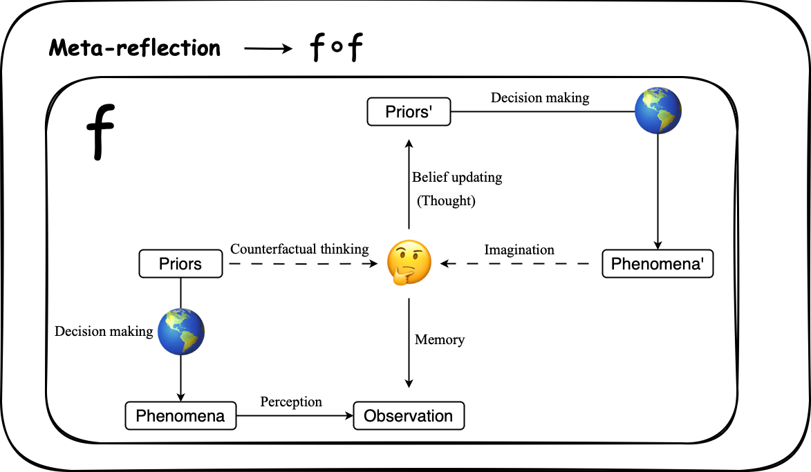
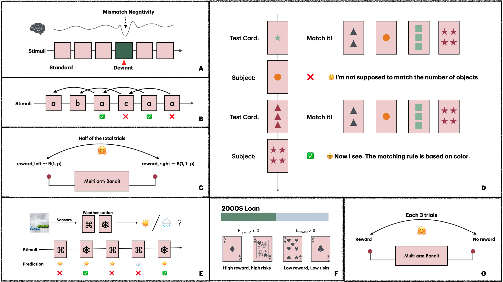
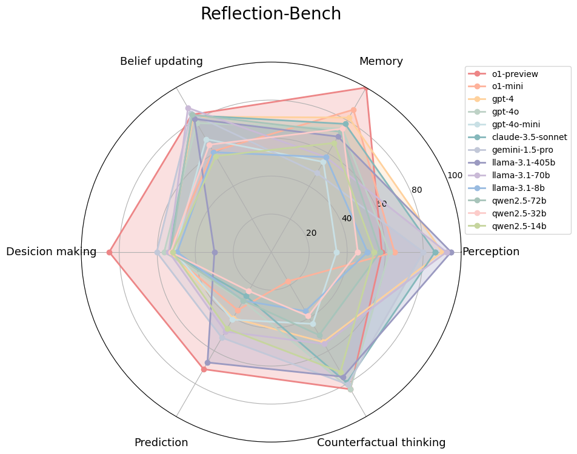
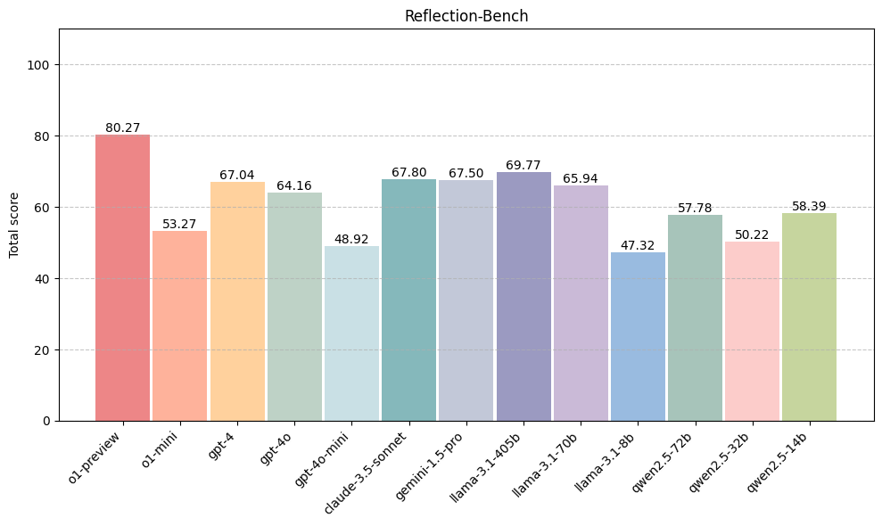

# 🪞Reflection-Bench: probing AI intelligence with reflection

    
     
    <em>Las Meninas</em>, Diego Velázquez, 1656

## Motivation: to what extent LLMs possess intelligence? 

[Geoffrey Hinton endorsed the legislation of SB 1047](https://x.com/geoffreyhinton/status/1833618540714217826), the strict AI safety bill, because he thinks that LLMs are actually reasoning and understanding. But [Yann LeCun criticized that Hinton's premature worries are originated from the overestimation of LLMs intelligence](https://x.com/ylecun/status/1833964689686225233) in [prediction, planning, common sense etc.](https://x.com/ylecun/status/1728496457601183865) Obviously, this longlasting debate on AI intelligence directly impacts our understanding of AI trustworthiness and regulation.

Lots of studies explore this question from various aspects such as reasoning, planning, cognitive flexibility, self cognition etc. These angles, however, seem to be interconnected in certain under-explained way related to epistemology of AI systems. So we aim to clarify this enigma from the lens of cognitive science and evaluate the general process of intelligence underlying above aspects.

## Reflection: the general process of intelligent systems

  
   
  <em>Reflection & Meta-reflection</em>

Intelligent systems existing in the uncertain world must ***interact with, learn about, and adapt to*** the environment. One emerging school in cognitive science describes these systems, from first principles, as predictive machines that keep predicting what will happen next with their internal models. Such a smart energy-saving strategy allows systems adapting to the environment flexibly only focusing on minimizing the unexpected by updating thoughts or actions. We define the general process of such intelligence in everyday life as ***reflection*** - predicting based on priors, making decision leading to desired state, perceiving mismatch between observation and prediction, updating prior belief accordingly. Reflection is a complex capability requiring cognitive elements including perception, memory, belief updating, decision making, prediction, counterfactual thinking, and meta-reflection.

Therefore, we can evaluate intelligence of AI systems by focusing on this general process of intelligence as well, i.e., **Reflection-Bench**.

## Reflection-Bench

Reflection-Bench involves 7 tasks corresponding to different cognitive elements required in reflection.

  
   
  <em>Reflection-Bench: assessment architecture</em>

## Experiment

| Cognition focus  | Task                                     | Trials| Sessions
|------------------|------------------------------------------|-------|---------|
| Perception       | Oddball Paradigm                         |50     | 3
| Working memory   | N-back task, n=2                         |52     | 2
| Belief updating  | Probability Reversal Task (PRT), p = 0.9 |40     | 2
| Decision making  | Wisconsin Card Sorting Task              |108    | 2
| Prediction       | Weather Prediction Task                  |100    | 2
| Counterfactual   | Double-Choice Iowa Gambling Task         |100    | 2
| Meta-reflection  | Meta-PRT, interval = 3, p = 1            |60     | 2

|Model            |$/1 M input tokens|$/ 1 M output tokens | Actual Cost ($)|
|-----------------|------------------|---------------------|----------------|
|o1-preview       | 15               | 60                  | 281
|o1-mini          | 3                | 12                  | 57
|gpt-4            | 10               | 30                  | 45
|gpt-4o           | 5                | 15                  | 20.1
|gpt-4o-mini      | 0.15             | 0.6                 | 0.6
|claude-3.5-sonnet| 3                | 15                  | 16.5
|gemini-1.5-pro   | 3.5              | 10.5                | 12
|llama-3.1-405b   | 6                | 6                   | 18
|llama-3.1-70b    | 0.35             | 0.4                 | 1.48
|llama-3.1-8b     | 0.05             | 0.05                | 0.27
|qwen-2.5-72b     | 0.57             | 1.71                | 0
|qwen-2.5-32b     | 0.5              | 1                   | 0
|qwen-2.5-14b     | 0.28             | 0.56                | 0

## Results

  

  
   
  <em>Performances of 13 moels on Reflection-Bench</em>

## Paper

For detailed information about Reflection-Bench, please read [our papaer]()!

You can cite Reflection-Bench as
